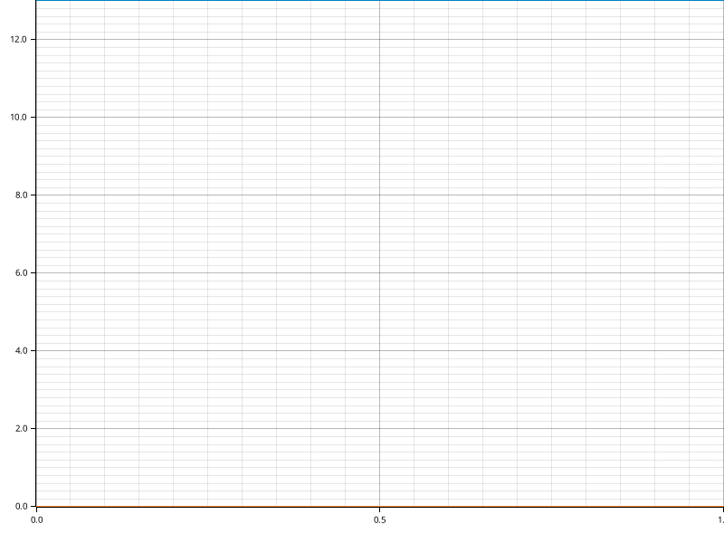

# Time Report for APS Generation

The total time spent on all tasks was 17 seconds.
The slowest task was `Clippy Fixes` which took 16 seconds, 296 ms, 207 µs and 303 ns (90.64% of all time).

| name                               | time                                  | percentage | comment |
|------------------------------------|---------------------------------------|------------|---------|
| Database Introspection             | 117 ms, 634 µs and 433 ns             | 0.65%      |         |
| Schema Validation                  | 300 ms, 328 µs and 955 ns             | 1.67%      |         |
| SQL Workspace Generation           | 756 ms, 155 µs and 265 ns             | 4.21%      |         |
| TOML Formatting                    | 149 ms, 151 µs and 329 ns             | 0.83%      |         |
| Code Formatting (1)                | 178 ms, 72 µs and 123 ns              | 0.99%      |         |
| Clippy Fixes                       | 16 seconds, 296 ms, 207 µs and 303 ns | 90.64%     |         |
| Code Formatting (2)                | 166 ms, 273 µs and 826 ns             | 0.92%      |         |
| Workspace Dependency Visualization | 7 ms, 212 µs and 342 ns               | 0.04%      |         |
| DAG Structure Visualization        | 7 ms, 739 µs and 279 ns               | 0.04%      |         |

## Time Report for SQL Workspace Generation

The total time spent on all tasks was now.
The slowest task was `writing_crate_lib` which took 732 ms, 664 µs and 361 ns (96.89% of all time).

| name                    | time                      | percentage | comment |
|-------------------------|---------------------------|------------|---------|
| writing_crate_toml      | 11 ms, 648 µs and 471 ns  | 1.54%      |         |
| writing_crate_lib       | 732 ms, 664 µs and 361 ns | 96.89%     |         |
| writing_sink_crate_toml | 600 µs and 510 ns         | 0.08%      |         |
| writing_sink_crate_lib  | 8 ms, 811 µs and 713 ns   | 1.17%      |         |
| workspace_toml          | 2 ms, 357 µs and 229 ns   | 0.31%      |         |
| workspace_rustfmt       | 72 µs and 981 ns          | 0.01%      |         |

